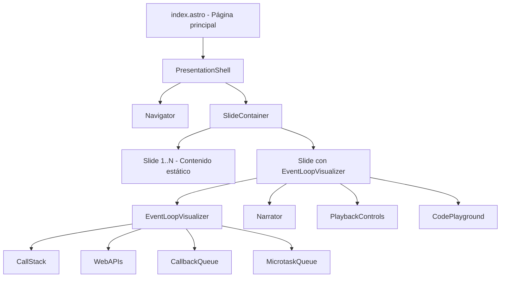
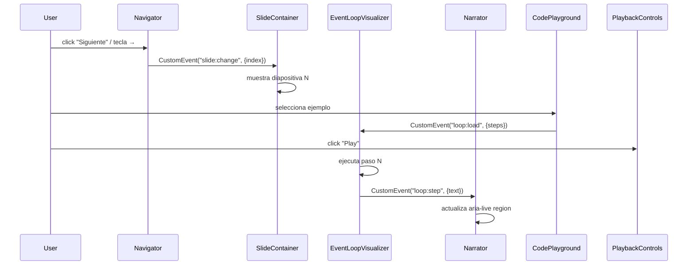

# Design Document: JavaScript Event Loop Presentation

## Overview

Aplicación web de presentación interactiva construida con **Astro** que explica el Event Loop de JavaScript de forma visual y didáctica. La presentación está compuesta por diapositivas navegables, un visualizador animado del Event Loop, narración contextual sincronizada y un playground de código interactivo.

El objetivo principal es que ingenieros sin experiencia en JavaScript puedan comprender el concepto intuitivamente, mientras que los ingenieros con experiencia puedan experimentar con escenarios reales.

### Stack Tecnológico

- **Framework**: Astro (generación estática + islas de interactividad)
- **Interactividad**: Vanilla JavaScript (Web Components o scripts de isla Astro)
- **Animaciones**: CSS Animations + Web Animations API
- **Editor de código**: CodeMirror 6 (resaltado de sintaxis, ligero)
- **Estilos**: CSS custom properties + CSS modules por componente
- **Diagramas SVG**: Inline SVG embebido en componentes Astro

---

## Architecture

La aplicación sigue el modelo de **Presentación de Página Única** (SPA-like) dentro de Astro, donde todas las diapositivas existen en el DOM pero solo una es visible a la vez. Esto evita recargas de página y permite transiciones fluidas.



### Modelo de Islas (Astro Islands)

- Las diapositivas de contenido estático son HTML puro renderizado en build time.
- Los componentes interactivos (`EventLoopVisualizer`, `CodePlayground`, `Navigator`) se hidratan como islas con `client:load`.
- El estado de la presentación (diapositiva actual) se gestiona con un pequeño store en memoria compartido entre islas vía eventos del DOM (`CustomEvent`).

### Flujo de Comunicación entre Componentes



---

## Components and Interfaces

### PresentationShell

Componente raíz Astro. Gestiona el layout global, importa estilos base y monta las islas.

```
PresentationShell
  ├── <head> con meta, fonts, CSS global
  ├── Navigator (client:load)
  ├── SlideContainer
  │     ├── Slide[0..N] (estáticos)
  │     └── Slide con EventLoopVisualizer (client:load)
  └── KeyboardHandler (script global)
```

### Navigator

Barra de navegación inferior. Emite eventos de cambio de diapositiva.

**Props / Estado:**
- `currentIndex: number`
- `total: number`

**Métodos:**
- `goTo(index)` — emite `CustomEvent("slide:change")`
- `next()` / `prev()`

**Renderiza:** botones Anterior/Siguiente + indicador "N / Total"

### SlideContainer

Contenedor que muestra/oculta diapositivas según el índice activo. Escucha `slide:change`.

**Comportamiento:** aplica clase `active` a la diapositiva correspondiente; las demás tienen `display: none` o `visibility: hidden` para preservar el estado de las islas.

### EventLoopVisualizer

Componente central. Recibe una secuencia de pasos (`AnimationStep[]`) y los ejecuta animadamente.

**Estado interno:**
- `steps: AnimationStep[]`
- `currentStep: number`
- `isPlaying: boolean`
- `speed: 'slow' | 'normal' | 'fast'`

**Métodos públicos (API de isla):**
- `load(steps: AnimationStep[])` — carga nueva secuencia
- `play()` / `pause()` / `reset()` / `stepForward()`

**Emite:**
- `CustomEvent("loop:step", { detail: { text: string, stepIndex: number } })`

### Narrator

Región de texto sincronizada con el visualizador. Escucha `loop:step`.

**Renderiza:** `<div role="status" aria-live="polite">` con el texto del paso actual.

### PlaybackControls

Botones de control de reproducción y slider de velocidad.

**Controles:** Play/Pausa, Reiniciar, Paso a Paso, Slider de velocidad (slow/normal/fast).

### CodePlayground

Editor de código con ejemplos predefinidos. Usa CodeMirror 6.

**Estado:**
- `selectedExample: number`
- `editorContent: string`

**Al seleccionar ejemplo:** emite `CustomEvent("loop:load", { detail: { steps } })` y reinicia el visualizador.

**Al pulsar "Ejecutar":** emite `CustomEvent("loop:play")`.

**Resaltado de línea activa:** escucha `loop:step` y aplica decoración en CodeMirror a la línea correspondiente.

---

## Data Models

### AnimationStep

Unidad atómica de la animación. Cada paso describe una transición de estado en el visualizador.

```typescript
type ComponentId = 'callStack' | 'webAPIs' | 'callbackQueue' | 'microtaskQueue';

interface AnimationBlock {
  id: string;          // identificador único del bloque (ej. "setTimeout-cb")
  label: string;       // texto visible en el bloque (ej. "cb()")
  color?: string;      // override de color (opcional, usa el del componente por defecto)
}

type AnimationAction =
  | { type: 'push';   target: ComponentId; block: AnimationBlock }
  | { type: 'pop';    target: ComponentId; blockId: string }
  | { type: 'move';   from: ComponentId;   to: ComponentId; blockId: string }
  | { type: 'highlight'; target: ComponentId }
  | { type: 'clear' };

interface AnimationStep {
  action: AnimationAction;
  narratorText: string;   // texto en español para el Narrator
  codeLine?: number;      // línea del código fuente asociada (para CodePlayground)
  durationMs?: number;    // duración override (usa velocidad global si no se especifica)
}
```

### PredefinedExample

```typescript
interface PredefinedExample {
  id: string;
  title: string;
  description: string;
  code: string;           // código JavaScript a mostrar en el editor
  steps: AnimationStep[]; // secuencia de pasos precalculada
}
```

### PresentationState

Estado global compartido entre islas vía eventos del DOM.

```typescript
interface PresentationState {
  currentSlide: number;   // índice 0-based
  totalSlides: number;
}
```

### SlideDefinition

Metadatos de cada diapositiva (definidos en un array estático en `index.astro`).

```typescript
interface SlideDefinition {
  id: string;
  title: string;
  type: 'content' | 'visualizer' | 'playground';
  component: string;      // nombre del componente Astro a renderizar
}
```

---

## Correctness Properties

*A property is a characteristic or behavior that should hold true across all valid executions of a system — essentially, a formal statement about what the system should do. Properties serve as the bridge between human-readable specifications and machine-verifiable correctness guarantees.*


### Property 1: Navegación avanza y retrocede correctamente

*Para cualquier* índice de diapositiva que no sea el primero ni el último, llamar a `next()` debe incrementar el índice en 1, y llamar a `prev()` debe decrementarlo en 1. En el índice 0, `prev()` no debe cambiar el estado. En el índice `total-1`, `next()` no debe cambiar el estado.

**Validates: Requirements 1.2, 1.3, 1.4, 1.5**

### Property 2: El indicador de diapositiva refleja el estado actual

*Para cualquier* índice de diapositiva válido, el texto renderizado por el Navigator debe contener el número `currentIndex + 1` y el total de diapositivas.

**Validates: Requirements 1.6**

### Property 3: Las transiciones de estado del visualizador son correctas

*Para cualquier* `AnimationStep` con acción `push`, `pop` o `move`, después de ejecutar ese paso el bloque debe encontrarse exactamente en el componente destino y no en el componente origen.

**Validates: Requirements 2.2, 2.3, 2.4, 2.5**

### Property 4: Las microtareas tienen prioridad sobre los callbacks

*Para cualquier* estado del visualizador donde el Call Stack está vacío y tanto la Microtask Queue como la Callback Queue contienen elementos, el siguiente paso de dequeue debe tomar de la Microtask Queue.

**Validates: Requirements 2.6**

### Property 5: El Narrator se sincroniza con cada paso de animación

*Para cualquier* `AnimationStep` ejecutado por el visualizador, el texto visible en el Narrator debe ser igual al campo `narratorText` de ese paso. Cuando la animación está en pausa, el texto debe permanecer igual al del último paso ejecutado.

**Validates: Requirements 3.1, 3.2, 3.4, 8.3**

### Property 6: El reinicio restaura el estado inicial

*Para cualquier* secuencia de pasos ejecutada (parcial o completa), llamar a `reset()` debe devolver el estado del visualizador a su estado inicial (currentStep = 0, todos los componentes vacíos, isPlaying = false).

**Validates: Requirements 4.2**

### Property 7: Cargar un ejemplo precarga código y pasos correctamente

*Para cualquier* ejemplo predefinido en `PredefinedExample[]`, al seleccionarlo el contenido del editor debe ser igual a `example.code` y los pasos cargados en el visualizador deben ser iguales a `example.steps`.

**Validates: Requirements 5.2**

### Property 8: La línea de código resaltada se sincroniza con el paso activo

*Para cualquier* `AnimationStep` que tenga definido el campo `codeLine`, después de ejecutar ese paso la línea resaltada en el editor debe ser igual a `step.codeLine`.

**Validates: Requirements 5.5**

### Property 9: La duración de cada paso está dentro del rango permitido

*Para cualquier* `AnimationStep`, la duración resuelta (considerando el override `durationMs` y la velocidad global) debe estar entre 300ms y 1000ms inclusive.

**Validates: Requirements 6.4**

### Property 10: Todos los botones de control tienen aria-label

*Para cualquier* botón de control renderizado (navegación, play, pausa, reiniciar, paso a paso), el elemento DOM debe tener un atributo `aria-label` con valor no vacío.

**Validates: Requirements 8.1**

### Property 11: El ratio de contraste cumple WCAG 2.1 AA

*Para cualquier* par (color de texto, color de fondo) usado en la presentación, el ratio de contraste calculado según la fórmula WCAG debe ser mayor o igual a 4.5:1.

**Validates: Requirements 8.2**

---

## Error Handling

### Navegación fuera de límites

El Navigator nunca debe permitir un índice negativo ni mayor o igual al total de diapositivas. Los botones se deshabilitan en los extremos y las llamadas programáticas se ignoran silenciosamente si el índice está fuera de rango.

### Pasos de animación inválidos

Si un `AnimationStep` referencia un `blockId` que no existe en el componente origen (para `pop` o `move`), el visualizador debe registrar un warning en consola y saltar al siguiente paso sin romper la animación.

### Carga de ejemplos

Si `example.steps` está vacío o malformado, el visualizador debe mostrar el estado inicial vacío y el Narrator debe mostrar un mensaje de error descriptivo en lugar de texto vacío.

### CodeMirror no disponible

Si CodeMirror falla al cargar (red, bundle error), el Code_Playground debe degradar gracefully mostrando el código en un `<pre>` con resaltado básico via CSS, sin bloquear el resto de la presentación.

---

## Testing Strategy

> Nota: El usuario ha indicado explícitamente que **no se requieren pruebas de ningún tipo** para este proyecto educativo. Esta sección se incluye como referencia de diseño para documentar las propiedades de corrección identificadas, pero no se implementarán tests.

### Propiedades identificadas para futura referencia

Si en algún momento se decidiera añadir tests, el enfoque recomendado sería:

**Unit tests** (ejemplos concretos):
- Verificar que el array de diapositivas tiene >= 8 elementos
- Verificar que el array de ejemplos predefinidos tiene >= 5 elementos
- Verificar que el DOM del visualizador contiene los cuatro componentes
- Verificar que cada botón de control tiene `aria-label`

**Property-based tests** (propiedades universales):
- Librería recomendada: `fast-check` (TypeScript/JavaScript)
- Configuración mínima: 100 iteraciones por propiedad
- Cada test debe referenciar la propiedad del diseño con el formato:
  `// Feature: javascript-event-loop-presentation, Property N: <texto>`

Las propiedades 1-11 definidas en la sección anterior son las candidatas directas para implementación con `fast-check`.
