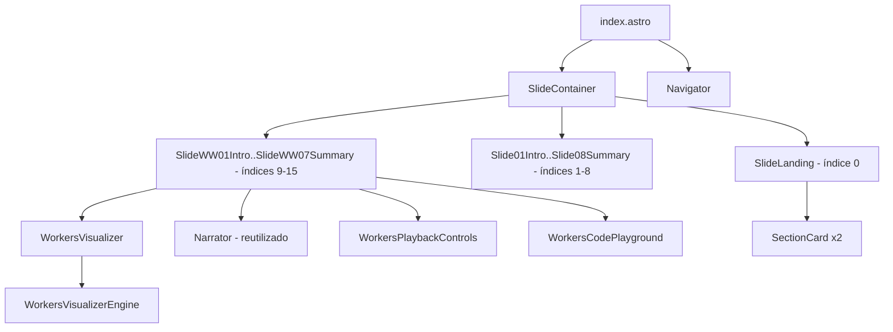
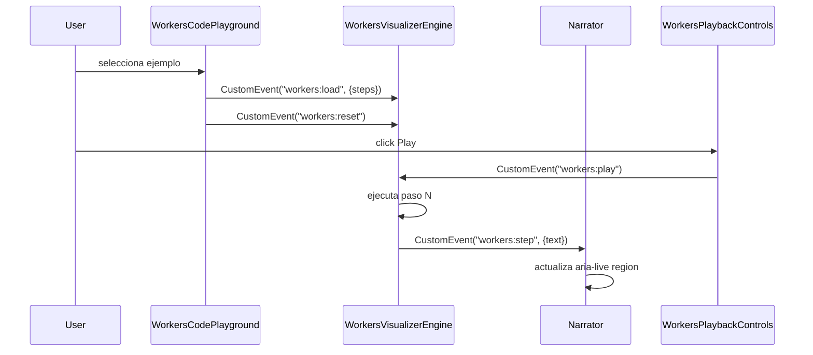

# Design Document: Web Workers Parallelism Section

## Overview

Extensión de la presentación interactiva de JavaScript (Astro) que añade:

1. **Landing Screen** — nueva diapositiva índice 0 que presenta los dos enfoques (Event Loop y Web Workers) y permite al usuario elegir sección.
2. **Sección Web Workers** — 7 diapositivas nuevas (WW01–WW07) que explican paralelismo real con Web Workers, incluyendo un visualizador animado de comunicación entre hilos, narración contextual, controles de reproducción y playground de código.

El resultado es una presentación con 16 diapositivas en total:
- Índice 0: Landing Screen
- Índices 1–8: Event Loop Section (existente, re-indexada)
- Índices 9–15: Web Workers Section (nueva)

### Stack Tecnológico (sin cambios)

- **Framework**: Astro (generación estática + islas de interactividad)
- **Interactividad**: Vanilla TypeScript (scripts de isla Astro)
- **Animaciones**: CSS Animations + Web Animations API
- **Editor de código**: CodeMirror 6
- **Estilos**: CSS custom properties (misma paleta existente + nuevas variables para Web Workers)
- **Diagramas**: Inline SVG embebido en componentes Astro

---

## Architecture

La arquitectura sigue el mismo modelo SPA-like de la presentación existente. Se añaden nuevos componentes sin modificar los existentes, salvo `index.astro` (para registrar las nuevas diapositivas y actualizar `TOTAL_SLIDES`) y `src/types.ts` (para los nuevos tipos de Web Workers).



### Flujo de Comunicación — Web Workers Section

Los nuevos componentes usan un bus de eventos propio (`workers:*`) para no interferir con el bus existente (`loop:*`).



### Re-indexación de Diapositivas

El `Navigator` ya gestiona el total dinámicamente. Solo hay que actualizar `TOTAL_SLIDES` en `index.astro` de 8 a 16 y añadir los nuevos `data-slide-index` en orden.

---

## Components and Interfaces

### SlideLanding (nuevo)

Diapositiva índice 0. Muestra dos `SectionCard` y permite navegar a cada sección.

**Props**: ninguna (estático)

**Comportamiento**: cada `SectionCard` emite `CustomEvent("slide:change", { index })` al hacer clic. La card del Event Loop navega al índice 1; la de Web Workers al índice 9.

**Renderiza**: título, subtítulo, dos `SectionCard`, distinción visual concurrencia vs. paralelismo.

---

### SectionCard (nuevo)

Componente visual interactivo dentro del Landing Screen.

**Props**:
```typescript
interface SectionCardProps {
  title: string;
  description: string;
  targetIndex: number;
  accentColor: string;   // CSS color var, ej. "var(--color-accent)"
  ariaLabel: string;     // ej. "Ir a la sección Event Loop"
}
```

**Comportamiento**: al hacer clic emite `slide:change` con `targetIndex`. Tiene estado hover con animación CSS.

---

### WorkersVisualizer (nuevo)

Componente central de la sección Web Workers. Muestra dos carriles (Main Thread / Worker Thread) y anima el flujo de mensajes entre ellos.

**Props**: ninguna (recibe pasos vía eventos del DOM)

**Estado interno** (gestionado por `WorkersVisualizerEngine`):
```typescript
interface WorkersVisualizerState {
  steps: WorkerAnimationStep[];
  currentStep: number;
  isPlaying: boolean;
  speed: 'slow' | 'normal' | 'fast';
  mainThreadBlocks: Map<string, HTMLElement>;
  workerThreadBlocks: Map<string, HTMLElement>;
}
```

**Escucha**: `workers:load`, `workers:play`, `workers:pause`, `workers:reset`, `workers:step-forward`, `workers:speed-change`

**Emite**: `workers:step` con `{ text: string, stepIndex: number, codeLine?: number }`

**Renderiza**: dos carriles verticales con etiquetas, indicadores de estado (idle/working/sending), área de bloques por carril, canal de mensajes central animado.

---

### WorkersVisualizerEngine (nuevo)

Clase TypeScript análoga a `VisualizerEngine` pero para el modelo de dos hilos.

**Archivo**: `src/scripts/workersVisualizer.ts`

**API pública**:
```typescript
class WorkersVisualizerEngine {
  load(steps: WorkerAnimationStep[]): void
  play(): void
  pause(): void
  reset(): void
  stepForward(): void
  setSpeed(speed: 'slow' | 'normal' | 'fast'): void
}
```

**Acciones soportadas** (ver Data Models):
- `push-main` / `push-worker`: añade bloque a un carril
- `pop-main` / `pop-worker`: elimina bloque de un carril
- `send-to-worker` / `send-to-main`: anima mensaje viajando entre carriles
- `set-status`: actualiza el indicador de estado de un hilo
- `highlight-main` / `highlight-worker`: resalta un carril
- `clear`: limpia ambos carriles

---

### WorkersPlaybackControls (nuevo)

Controles de reproducción para la sección Web Workers. Idénticos en funcionalidad a `PlaybackControls` pero emiten eventos `workers:*`.

**Archivo**: `src/components/WorkersPlaybackControls.astro`

**Controles**: Play/Pausa, Reiniciar, Paso a Paso, Slider de velocidad (lento/normal/rápido).

**Emite**: `workers:play`, `workers:pause`, `workers:reset`, `workers:step-forward`, `workers:speed-change`

---

### WorkersCodePlayground (nuevo)

Playground de código para la sección Web Workers. Análogo a `CodePlayground` pero con soporte para dos paneles de código (hilo principal / worker).

**Archivo**: `src/components/WorkersCodePlayground.astro`

**Estado**:
```typescript
interface WorkersPlaygroundState {
  selectedExample: number;
  activeTab: 'main' | 'worker';
}
```

**Al seleccionar ejemplo**: emite `workers:load` con los pasos del ejemplo y `workers:reset`.

**Renderiza**: selector de ejemplos, pestañas "Hilo Principal" / "Worker", editor CodeMirror, descripción del ejemplo.

**Resaltado de línea**: escucha `workers:step` y aplica decoración en CodeMirror a la línea correspondiente del panel activo.

---

### Narrator (reutilizado)

El componente `Narrator.astro` existente se reutiliza sin modificaciones. Para la sección Web Workers, se añade un segundo listener en el script del visualizador que también emite `loop:step` cuando procesa `workers:step`, o bien se instancia un segundo `Narrator` que escuche `workers:step`.

**Decisión de diseño**: se crea un `WorkersNarrator` mínimo (copia del Narrator que escucha `workers:step`) para evitar acoplar los dos buses de eventos y no modificar el componente existente.

---

### Diapositivas Web Workers (nuevas)

| Índice | Componente | Contenido |
|--------|-----------|-----------|
| 9  | `SlideWW01Intro.astro` | Qué es un Web Worker, propósito |
| 10 | `SlideWW02BlockedThread.astro` | El problema del hilo bloqueado, analogía visual |
| 11 | `SlideWW03Threads.astro` | Main Thread vs Worker Thread, diagrama paralelo |
| 12 | `SlideWW04Messages.astro` | postMessage / evento message, structured clone |
| 13 | `SlideWW05UseCases.astro` | Casos de uso reales (≥3 escenarios) |
| 14 | `SlideWW06Visualizer.astro` | WorkersVisualizer + WorkersPlaybackControls + WorkersCodePlayground + WorkersNarrator |
| 15 | `SlideWW07Summary.astro` | Diagrama completo, tabla comparativa EL vs WW, recursos |

---

## Data Models

### WorkerThreadId

```typescript
type WorkerThreadId = 'main' | 'worker';
```

### WorkerAnimationAction

```typescript
type WorkerAnimationAction =
  | { type: 'push-main';       block: AnimationBlock }
  | { type: 'push-worker';     block: AnimationBlock }
  | { type: 'pop-main';        blockId: string }
  | { type: 'pop-worker';      blockId: string }
  | { type: 'send-to-worker';  blockId: string; label: string }
  | { type: 'send-to-main';    blockId: string; label: string }
  | { type: 'set-status';      thread: WorkerThreadId; status: ThreadStatus }
  | { type: 'highlight-main' }
  | { type: 'highlight-worker' }
  | { type: 'clear' };

type ThreadStatus = 'idle' | 'working' | 'sending';
```

### WorkerAnimationStep

```typescript
interface WorkerAnimationStep {
  action: WorkerAnimationAction;
  narratorText: string;    // texto en español para el Narrator
  codeLine?: number;       // línea del código del hilo principal
  workerCodeLine?: number; // línea del código del worker
  durationMs?: number;     // override de duración
}
```

### WorkerPredefinedExample

```typescript
interface WorkerPredefinedExample {
  id: string;
  title: string;
  description: string;
  mainCode: string;    // código del hilo principal
  workerCode: string;  // código del worker (archivo separado)
  steps: WorkerAnimationStep[];
}
```

### Extensión de tipos existentes

Se añaden los nuevos tipos a `src/types.ts` sin modificar los existentes:

```typescript
// Añadir a src/types.ts
export type WorkerThreadId = 'main' | 'worker';
export type ThreadStatus = 'idle' | 'working' | 'sending';
export type WorkerAnimationAction = /* ... ver arriba ... */;
export interface WorkerAnimationStep { /* ... */ }
export interface WorkerPredefinedExample { /* ... */ }
```

### Serialización / Deserialización

Los `WorkerAnimationStep[]` se definen como literales TypeScript en `src/data/workerExamples.ts` (análogo a `examples.ts`). La serialización a JSON se valida con una función guard:

```typescript
function isWorkerAnimationStep(obj: unknown): obj is WorkerAnimationStep {
  if (typeof obj !== 'object' || obj === null) return false;
  const s = obj as Record<string, unknown>;
  return (
    typeof s.narratorText === 'string' &&
    typeof s.action === 'object' &&
    s.action !== null &&
    typeof (s.action as Record<string, unknown>).type === 'string'
  );
}

function parseWorkerSteps(json: string): WorkerAnimationStep[] {
  const parsed: unknown = JSON.parse(json);
  if (!Array.isArray(parsed)) throw new Error('Expected array of WorkerAnimationStep');
  return parsed.map((item, i) => {
    if (!isWorkerAnimationStep(item)) {
      throw new Error(`Item at index ${i} is not a valid WorkerAnimationStep`);
    }
    return item;
  });
}
```

### Variables CSS nuevas

```css
/* Añadir a global.css */
--color-main-thread:       #38BDF8;   /* reutiliza --color-accent */
--color-main-thread-bg:    #0C2A3F;
--color-worker-thread:     #F472B6;   /* rosa para diferenciar */
--color-worker-thread-bg:  #3D0A24;
--color-message-block:     #FCD34D;
--color-message-block-bg:  #3D2A00;
```

---

## Correctness Properties

*A property is a characteristic or behavior that should hold true across all valid executions of a system — essentially, a formal statement about what the system should do. Properties serve as the bridge between human-readable specifications and machine-verifiable correctness guarantees.*


### Property 1: Navegación por SectionCard lleva al índice correcto

*Para cualquier* `SectionCard` con un `targetIndex` definido, hacer clic en ella debe emitir `slide:change` con ese `targetIndex` exacto, resultando en que el Navigator muestre la diapositiva correspondiente.

**Validates: Requirements 1.3, 1.4**

---

### Property 2: Botones de navegación se deshabilitan en los extremos

*Para cualquier* presentación con `N` diapositivas totales, cuando `currentIndex === 0` el botón "Anterior" debe estar deshabilitado, y cuando `currentIndex === N-1` el botón "Siguiente" debe estar deshabilitado.

**Validates: Requirements 1.7, 2.4**

---

### Property 3: El indicador del Navigator refleja el estado actual

*Para cualquier* índice de diapositiva válido entre 0 y `total-1`, el texto renderizado por el Navigator debe contener el número `currentIndex + 1` y el total de diapositivas.

**Validates: Requirements 2.3**

---

### Property 4: Las diapositivas con analogías visuales contienen SVG embebido

*Para cualquier* diapositiva de la Web Workers Section que contenga una analogía visual según los requisitos, el DOM de esa diapositiva debe contener al menos un elemento `<svg>`.

**Validates: Requirements 3.4**

---

### Property 5: Los mensajes entre hilos aparecen en el carril destino

*Para cualquier* `WorkerAnimationStep` con acción `send-to-worker` o `send-to-main`, después de ejecutar ese paso debe existir un bloque con el `blockId` correspondiente en el carril destino (worker o main respectivamente).

**Validates: Requirements 5.2, 5.3**

---

### Property 6: El indicador de estado del hilo refleja la acción set-status

*Para cualquier* `WorkerAnimationStep` con acción `set-status`, después de ejecutar ese paso el indicador visual del hilo especificado debe mostrar el nuevo estado (`idle`, `working` o `sending`).

**Validates: Requirements 5.6**

---

### Property 7: El Narrator se sincroniza con cada paso del Workers Visualizer

*Para cualquier* `WorkerAnimationStep` ejecutado por el `WorkersVisualizerEngine`, el texto visible en el Narrator debe ser igual al campo `narratorText` de ese paso. Cuando la animación está en pausa, el texto debe permanecer igual al del último paso ejecutado.

**Validates: Requirements 6.1, 6.2, 6.3**

---

### Property 8: El reinicio restaura el estado inicial del Workers Visualizer

*Para cualquier* secuencia de `WorkerAnimationStep[]` ejecutada (parcial o completa), llamar a `reset()` debe devolver el estado del engine a su estado inicial: `currentStep = 0`, ambos carriles vacíos, `isPlaying = false`.

**Validates: Requirements 7.2**

---

### Property 9: El modo paso a paso no avanza automáticamente

*Para cualquier* estado del `WorkersVisualizerEngine` donde se ha llamado a `stepForward()` sin llamar a `play()`, el engine no debe avanzar al siguiente paso sin una nueva llamada explícita a `stepForward()`.

**Validates: Requirements 7.4**

---

### Property 10: Seleccionar un ejemplo carga código y pasos correctamente

*Para cualquier* ejemplo predefinido en `WorkerPredefinedExample[]`, al seleccionarlo el editor del hilo principal debe mostrar `example.mainCode`, el editor del worker debe mostrar `example.workerCode`, y los pasos cargados en el visualizador deben ser iguales a `example.steps`.

**Validates: Requirements 8.2**

---

### Property 11: La línea de código resaltada se sincroniza con el paso activo

*Para cualquier* `WorkerAnimationStep` que tenga definido el campo `codeLine`, después de ejecutar ese paso la línea resaltada en el editor del hilo principal debe ser igual a `step.codeLine`.

**Validates: Requirements 8.5**

---

### Property 12: Todos los botones de control nuevos tienen aria-label no vacío

*Para cualquier* botón de control renderizado en los nuevos componentes (SectionCard, WorkersPlaybackControls, WorkersCodePlayground), el elemento DOM debe tener un atributo `aria-label` con valor no vacío.

**Validates: Requirements 10.1, 10.2**

---

### Property 13: El ratio de contraste cumple WCAG 2.1 AA en la nueva sección

*Para cualquier* par (color de texto, color de fondo) usado en los nuevos componentes de la Web Workers Section, el ratio de contraste calculado según la fórmula WCAG debe ser mayor o igual a 4.5:1.

**Validates: Requirements 10.5**

---

### Property 14: Round-trip de serialización de WorkerAnimationStep

*Para cualquier* array válido de `WorkerAnimationStep[]`, serializarlo con `JSON.stringify` y luego deserializarlo con `parseWorkerSteps` debe producir un array equivalente al original (mismos campos y valores).

**Validates: Requirements 11.1, 11.2**

---

### Property 15: Rechazo de pasos malformados en deserialización

*Para cualquier* objeto JSON que no cumpla el esquema de `WorkerAnimationStep` (falta `narratorText`, falta `action`, o `action.type` no es string), `parseWorkerSteps` debe lanzar un error con mensaje descriptivo en lugar de retornar un paso malformado.

**Validates: Requirements 11.3**

---

## Error Handling

### Navegación fuera de límites

El Navigator existente ya maneja este caso. Con el nuevo total de 16 diapositivas, el comportamiento es idéntico: índices negativos o >= total se ignoran silenciosamente y los botones se deshabilitan en los extremos.

### blockId inexistente en Workers Visualizer

Si un `WorkerAnimationStep` con acción `pop-main`, `pop-worker`, o `send-to-*` referencia un `blockId` que no existe en el carril origen, el `WorkersVisualizerEngine` debe registrar un `console.warn` con el blockId y el carril, y continuar con el siguiente paso sin interrumpir la animación (análogo al comportamiento de `VisualizerEngine`).

### Carga de ejemplos vacíos o malformados

Si `example.steps` está vacío o malformado al llamar a `load()`, el engine debe mostrar el estado inicial vacío y emitir un `workers:step` con un texto de error descriptivo en español para el Narrator.

### Deserialización inválida

Si `parseWorkerSteps` recibe JSON que no es un array, o contiene items que no pasan `isWorkerAnimationStep`, debe lanzar un `Error` con un mensaje que incluya el índice del item inválido.

### CodeMirror no disponible

Si CodeMirror falla al cargar en `WorkersCodePlayground`, el componente degrada gracefully mostrando el código en un `<pre>` con resaltado básico via CSS, sin bloquear el resto de la presentación (mismo patrón que `CodePlayground`).

---

## Testing Strategy

> Nota: El usuario ha indicado que no se requieren pruebas para este proyecto educativo. Esta sección documenta las propiedades identificadas como referencia de diseño.

### Enfoque recomendado (si se implementaran tests)

**Librería**: `fast-check` (TypeScript/JavaScript) — misma que la sección existente.

**Configuración**: mínimo 100 iteraciones por propiedad.

**Tag format**: `// Feature: web-workers-parallelism-section, Property N: <texto>`

### Unit tests (ejemplos concretos)

Verificarían assertions estructurales identificadas como "yes - example" en el prework:

- La presentación tiene exactamente 16 diapositivas (Landing + 8 EL + 7 WW)
- El array `workerExamples` tiene >= 3 elementos
- El DOM del Workers Visualizer contiene dos carriles con las etiquetas correctas
- Cada botón de control tiene `aria-label` no vacío
- El slider de velocidad tiene `min=0`, `max=2`, `step=1`
- La diapositiva de resumen contiene una tabla comparativa con >= 4 filas
- La diapositiva de casos de uso contiene >= 3 escenarios

### Property-based tests (propiedades universales)

Cada propiedad de la sección anterior es candidata directa para implementación con `fast-check`:

| Propiedad | Generadores necesarios |
|-----------|----------------------|
| P1: SectionCard navigation | `fc.integer({ min: 0, max: 15 })` para targetIndex |
| P2: Navigator boundary buttons | `fc.integer({ min: 0, max: 15 })` para currentIndex |
| P3: Navigator indicator text | `fc.integer({ min: 0, max: 15 })` para currentIndex |
| P4: SVG en diapositivas con analogías | Verificación estructural del DOM |
| P5: Mensajes aparecen en carril destino | Generador de `WorkerAnimationStep` con send actions |
| P6: Indicador de estado del hilo | Generador de `set-status` steps con status aleatorio |
| P7: Narrator sincronizado | Generador de `WorkerAnimationStep[]` arbitrarios |
| P8: Reset restaura estado inicial | Generador de secuencias parciales de pasos |
| P9: Paso a paso no avanza solo | Verificación de estado tras stepForward() |
| P10: Selección de ejemplo carga datos | `fc.integer({ min: 0, max: workerExamples.length - 1 })` |
| P11: Línea resaltada sincronizada | Generador de steps con codeLine definido |
| P12: aria-label en botones | Verificación estructural del DOM |
| P13: Contraste WCAG 4.5:1 | Pares de colores CSS de la nueva sección |
| P14: Round-trip serialización | Generador de `WorkerAnimationStep[]` válidos |
| P15: Rechazo de pasos malformados | Generador de objetos JSON inválidos |
